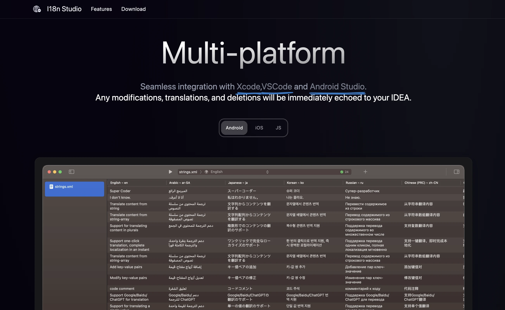
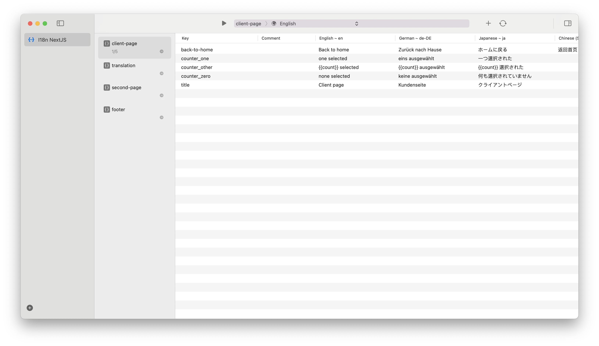
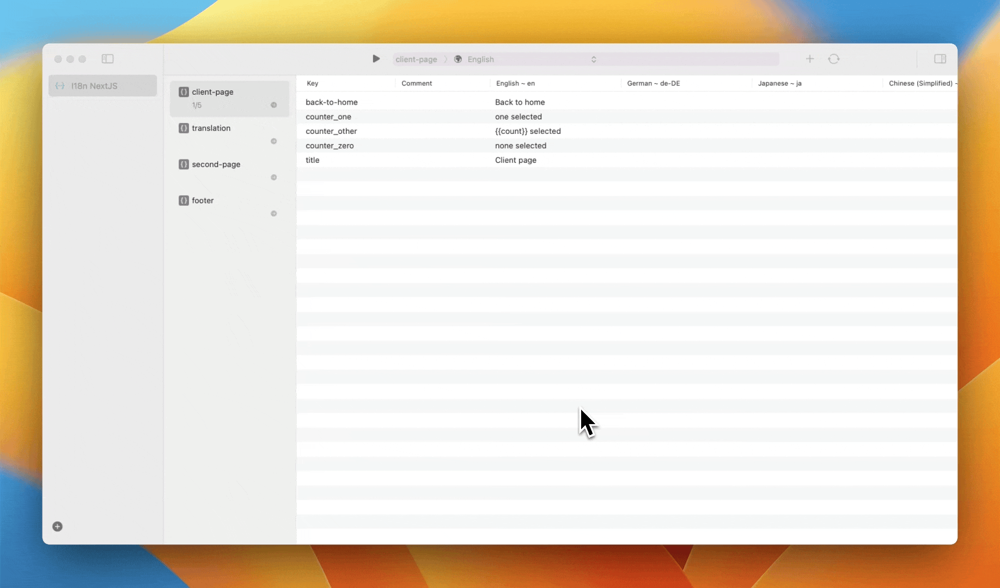
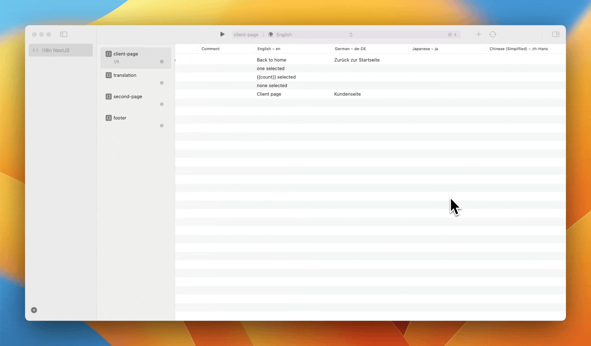
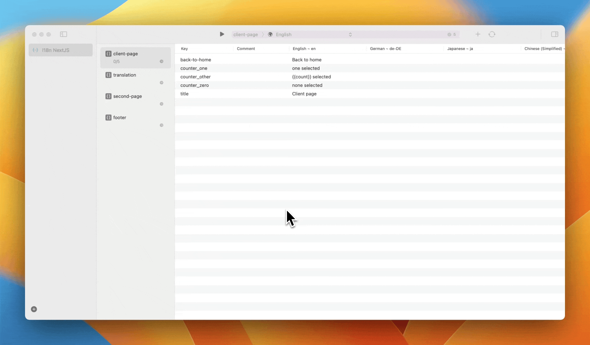

# i18n-nextjs

NextJS Demo for translate json files using I18n Studio.

## Introduction

This project introduces the use of I18n Studio to load, translate, modify, and delete data in json files.

****I18n Studio:****

A developer tool for easily completing i18n using GPT4.

For iOS, macOS, Android, and JS developers, translating multiple languages can be a painful task. However, I18n Studio makes this process incredibly simple. With just a click of a button, GPT4 can instantly complete the translation of multiple languages.

## Usage

****Requirement****:

* Download [I18n Studio](https://i18n.studio)

* Download this project

#### Load key-value pairs from json files

1. Open I18n Studio

2. Click the button in the lower left corner to add a project and select the `JSON` tab.

3. Enter the project name such as “I18n NextJS”

4. Select the workspace of this project, for example `/Users/xxx/Desktop/i18n/Demo/i18n-nextjs`

5. Click the add button,select the locales directory, for example`/Users/xxx/Desktop/i18n/Demo/i18n-nextjs/app/i18n/locales`

At this time, I18n Studio will load and display the json files in the project.

#### Translate

Click the language selection button at the top of I18n Studio to select the source language of the project. When translating, you need to translate it into other languages. The default is English.

> Please ensure that the source language has data available for translation.

****1.Translate Value****

Translate individual key-value pairs

****2.Translate Key****

Click the button in the upper right corner to switch to GPT4.Then translate entire row of key-value pairs

> Batch translation must use GPT4, which is only available to subscribed users.

****3.Translate Language****

Translate into a language

****4.Translate All****

Click the Translate button at the top to translate the source language to all target languages.

Return to VS Code to view, you can see that all translation content has been echoed to VS Code.

****5.Add/remove languages****

1.Click the button in the upper right corner

2.Language:Click to check/uncheck to add/remove languages

****6.Delete key-value pairs****

Select a single row to delete a single key-value pair.

Select multiple rows to delete multiple key-value pairs.

****7.Search****

cmd + f to search data

## Support

 If you have any questions or feedback,please feel free to contact us.

Email(Prefer): [support@i18n.studio](mailto:support@i18n.studio)

Telegram: [https://t.me/+tXj3CynRslIwZDY1](https://t.me/+tXj3CynRslIwZDY1)

## License

fork from https://github.com/anilkk/nextjs-13-i18next-demo-project

MIT License © I18n Studio Team